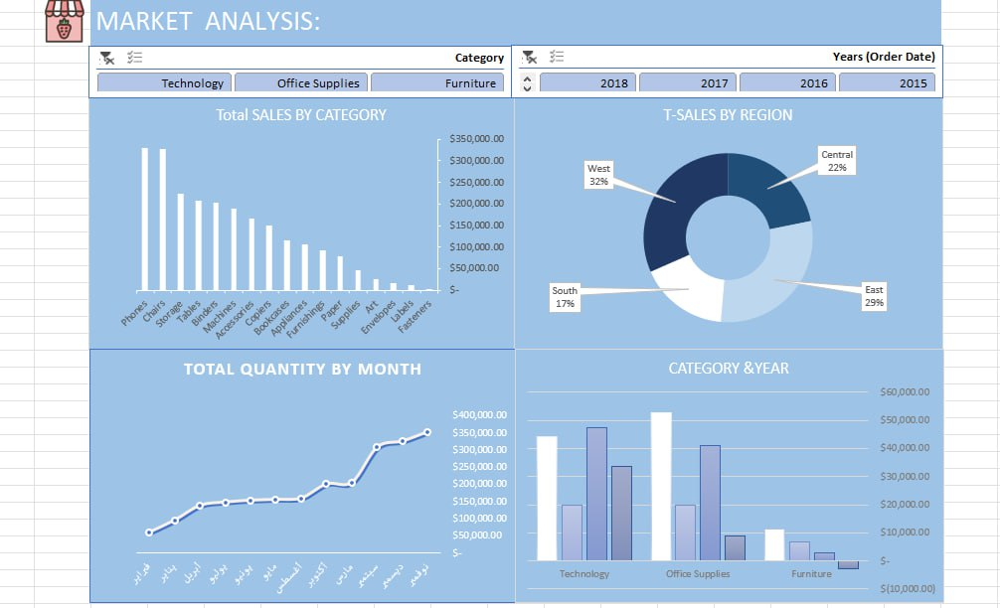

# 🛒 Market Analysis Dashboard

## 📌 Project Overview

This project focuses on analyzing market sales data to understand business performance, sales distribution, product categories, regional performance, and yearly trends.

The dashboard provides interactive insights into sales, quantity, category performance, and regional analysis to support better business decisions.

---

## 📊 Dashboard Preview

---

## 🎯 Objectives

- Analyze total sales performance
- Compare sales across different product categories
- Identify top performing regions
- Analyze quantity trends over time
- Understand yearly sales changes
- Evaluate category performance by year

---

## 🛠 Tools Used

- Microsoft Excel
- Pivot Tables
- Data Cleaning
- Charts & Visualization
- Dashboard Design

---

## 📈 Key Insights

- Technology category shows strong sales performance compared to other categories
- Sales distribution varies across different regions
- East and West regions contribute significantly to total sales
- Monthly quantity trends show growth over time
- Yearly comparison helps identify category performance changes
- Product categories have different contributions to overall revenue

---

## 🔍 Dashboard Features

### Filters:
- Category
- Year (Order Date)

### Visualizations:
- Total Sales by Category
- Total Sales by Region
- Total Quantity by Month
- Category & Year Analysis

---

## 📂 Project Structure
